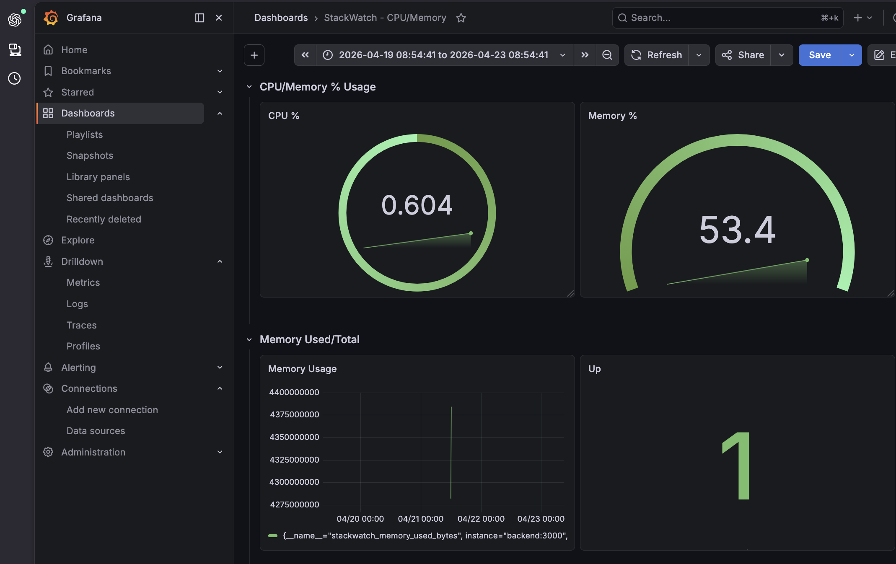
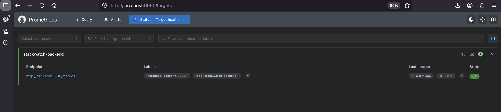

# StackWatch

Live Demo: http://184.169.244.68

StackWatch is a full stack monitoring platform built to demonstrate how modern applications are developed, deployed, monitored, and operated. It combines a custom frontend dashboard with a backend metrics API, containerized services, infrastructure automation, and industry standard observability tooling.

The project originally began as a custom real time dashboard for displaying system metrics through a React frontend. As development progressed, it evolved into a broader observability platform after I integrated Prometheus and Grafana to separate user facing monitoring from operational monitoring.

The goal of the project was not only to display system metrics, but to understand the full lifecycle of a production style system: application development, deployment, networking, monitoring, persistance, and cloud infrastructure.

---

## Purpose

Many dashboards only focus on frontend visuals. StackWatch was built to understand behind the visuals.

I wanted to understand questions such as:

* How does a frontend communicate with backend services?
* How are applications containerized and deployed consistently?
* How are metrics exposed and collected in real environments?
* How do monitoring tools like Prometheus and Grafana fit into a system?
* How can infrastructure be recreated through code instead of manual setup?

StackWatch became a project focused on both software engineering and operations thinking.

## What It Does

StackWatch collects system metrics in real time and displays them through multiple layers

## Custom Application Dashboard

The React frontend provides a user friendly monitoring interface that displays:

* CPU usage
* Memory usage
* Disk usage
* Real time chart updates
* Threshold based alerts
* System health states

```js
const interval = setInterval(() => {
   fetchMetricsData();
}, 5000);
```

## Metrics Pipeline

The backend also exposes Prometheus compatible metrics so external monitoring tools cna scrape and analyze the system.

```js
app.use('/api/metrics', metricsRoute);
app.use('/metrics', prometheusRoute);
```


## Observability Layer

Prometheus stores time series metrics, while Grafana visualizes that data through dashboards.

This means StackWatch supports both:
* custom application monitoring
* professional observability workflows

## Why I Chose This Stack

### Frontend: React + Vite

I chose React because it allows reusable UI components and real time state updates. Vite provides a fast local development experience.

### Backend: Node.js + Express

Node.js and Express made it simple to expose API endpoints, process metrics data, and integrate monitoring libraries.

### Docker + Docker Compose

I used Docker to package services consistently across environments. Docker Compose allowed me to run the frontend, backend, Prometheus, and Grafana together as one stack.

```yaml
services:
   frontend:
   backend:
   prometheus:
   grafana:
volumes:
```

### Prometheus + Grafana

These are widely used industry tools for monitoring systems.

* Prometheus handles scraping and storing metrics
* Grafana handles dashboards and visualization

I chose them to learn how real operations teams monitor infrastructure.

### Terraform + AWS EC2

I wanted to understand infrastructure as code and cloud deployment.

Terraform provisions:
* EC2 compute instance
* security groups
* Elastic IP
* automated bootstrap scripts

AWS EC2 was used to host the full stack in a real cloud environment.

```t
resource "aws_instance" "stackwatch_ec2" {
   instance_type = "t3.micro"
}
```

## System Architecture

Browser User
    ↓
React Frontend (Port 80)
    ↓
Node.js / Express Backend (Port 3000)
    ↓
System Metrics Collection

Prometheus (Port 9090)
    ↓ scrapes /metrics

Grafana (Port 3001)
    ↓ queries Prometheus

## API Design

### Application Metrics

   ```text
   GET /api/metrics
   ```

Returns JSON data used by the custom frontend dashboard.

### Prometheus Metrics

   ```text
   GET /metrics
   ```

Returns Prometheus formatted metrics for scraping.

This separation allows one backend to serve both user facing monitoring and machine readable observability data.

## Engineering Decisions

### Alert Logic

I implemented threshold based alerting with state transitions to reduce repeated notifications when metrics hover near warning thresholds.

```js
  const getMetricStatus = (value) => {
    if (value >= 85) return 'critical';
    if (value >= 60) return 'warning';
    return 'normal';
  };
```

```js
if (alerts.length > 0) {
setAlertLog((prevLog) => {
   const filteredAlerts = alerts.filter((alert) => {
      return !prevLog.some(
      (existingAlert) =>
         existingAlert.metric === alert.metric &&
         existingAlert.status === alert.status &&
         existingAlert.value === alert.value
      );
   });
   return [...filteredAlerts, ...prevLog].slice(0,20);
});
}
```

### Persistent Volumes

Grafana and Prometheus use Docker named volumes so dashboards, credentials, and metric history survive container restarts.

### Container Networking

Services communicate internally through Docker Compose networking using service names rather than hardcoded IP addresses.

### Infrastructure as Code

Instead of manually configuring servers each time, Terraform recreates the environment consistently.

## Running Locally

```bash
docker compose up -d
```
Services:
* Frontend http://localhost
* Backend: http://localhost:3000/api/metrics
* Prometheus http://localhost:9090
* Grafana: http://localhost:3001

## Cloud Deployment

Live Demo: 
   http://184.169.244.68

Infrastructure is provisioned and repeatable through Terraform

## What This Project Demonstrates
* Full stack development
* Backend API design
* Real time frontend state management
* Docker containerization
* Multi service orchestration
* Monitoring and observability
* Infrastructure as code
* Cloud deployment
* Debugging networking and deployment issues
* Understanding systems at a higher architectural level

## Screenshots

### StackWatch Dashboard


### Grafana Dashboard




### Prometheus Targets




## Future Improvements (StackWatch V2)
* GitHub Actions CI/CD pipeline
* Kubernetes deployment
* Alertmanager integration