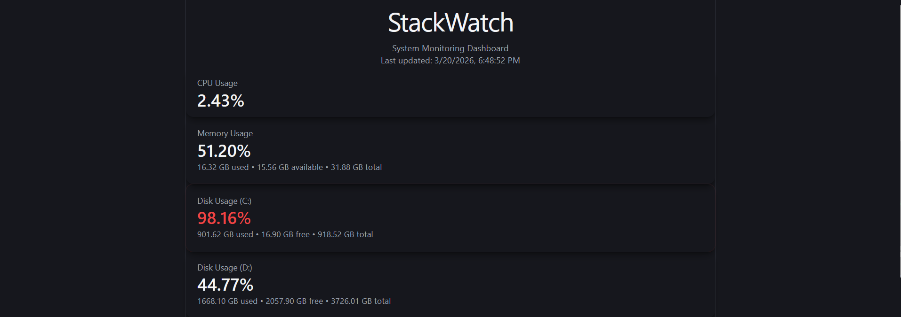
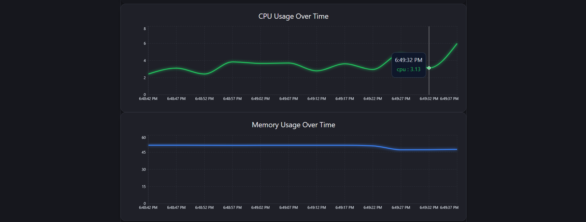

# StackWatch

StackWatch is a real-time system monitoring dashboard that visualizes CPU, memory, and disk usage with intelligent alerting. It is built as a full-stack application and deployed on AWS EC2 using Docker.

---

## 🚀 Overview

StackWatch provides a lightweight observability solution for monitoring system performance. It collects live metrics from the host machine and displays them in a responsive dashboard with charts and alert tracking.

The application supports running locally, inside Docker containers, and on cloud infrastructure, making it flexible across different environments.

---

## ✨ Features

* Real-time system monitoring (CPU, memory, disk)
* Live updating charts
* Intelligent alert system

  * State-based alerts (normal → warning → critical)
  * Delta-based suppression to prevent alert spam
* Alert log with severity indicators
* Multi-environment support (local, Docker, AWS EC2)

---

## 🛠 Tech Stack

**Frontend**

* React (Vite)
* JavaScript
* CSS

**Backend**

* Node.js
* Express

**DevOps / Deployment**

* Docker & Docker Compose
* AWS EC2

---

## 🧠 How It Works

```
Frontend (React) → Backend API (Express) → System Metrics (Host Machine)
```

The backend collects system metrics and exposes them through an API. The frontend polls this API at regular intervals and updates the UI in real time.

---

## ⚙️ Environment Configuration

The frontend uses environment variables to determine the backend API:

```
VITE_API_BASE_URL=http://localhost:3000
```

This allows seamless switching between local and deployed environments.

---

## 🧪 Running Locally

### 1. Backend

```
cd backend
npm install
npm run dev
```

### 2. Frontend

```
cd frontend
npm install
npm run dev
```

Open:

```
http://localhost:5173
```

---

## 🐳 Running with Docker

From the root directory:

```
docker-compose up --build
```

Then open:

```
http://localhost:5173
```

---

## ☁️ Deployment (AWS EC2)

The application was deployed on an AWS EC2 instance using Docker.

Steps:

1. Launch EC2 instance (Ubuntu, t2.micro)
2. Install Docker and Docker Compose
3. Clone repository
4. Configure environment variables
5. Run:

   ```
   docker-compose up -d --build
   ```
6. Access via:

   ```
   http://<ec2-public-ip>:5173
   ```

---

## ⚠️ Notes

* When the backend runs inside Docker, it monitors container-level metrics.
* When running locally or on EC2, it monitors the host machine.
* Public EC2 IP may change when the instance is restarted.

---

## 📸 Demo

### Dashboard


### Chart


### Alerts


---